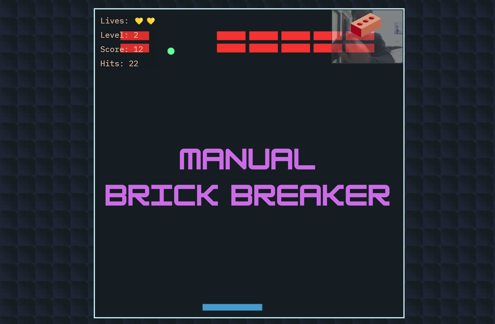

Manual Brick Breaker
=======

Play brick breaker the way our ancestors wanted us to -- with our hands!

✋ Move your hand left/right, keeping your palm in front of your camera

🧱 Break all the bricks to advance to the next level

🎚️ Each level increases ball speed by 10% and reduces paddle width by 10%

⚠️ Make sure your webcam is enabled and your palm is visible

All processing is done in real-time within your browser. This project is built using javascript, html canvas, and mediapipe hand tracking.

This game is free and open source, offered under an MIT license (you can use the code for personal or commercial purposes).

If you enjoyed this and are feeling generous, feel free to buy me a coffee. I will continue to build free and open source projects, and this would be much appreciated during late-night coding sessions!

I do not have access to any of your data or webcam video, as all processing is done "client-side" (i.e., <b>no videos or images are saved/stored by me — they appear on your computer only</b>).

If you enjoyed this, you may be interested in my other free / open source projects:

<ul>
<li><a href="https://collidingScopes.github.io/ascii" target="_blank" rel="noopener">Video-to-ASCII</a>: turn videos into ASCII pixel art</li>
<li><a href="https://collidingScopes.github.io/shimmer" target="_blank" rel="noopener">Shape Shimmer</a>: turn photos into funky wave animations</li>
<li><a href="https://collidingScopes.github.io" target="_blank" rel="noopener">Colliding Scopes</a>: turn photos into kaleidoscope animations</li>
<li><a href="https://collidingScopes.github.io/forcefield" target="_blank" rel="noopener">Force-Field Animation</a>: turn photos into particle animations</li>
</ul>

License
=======
This is an open source project provided under an <a href="https://opensource.org/license/MIT">MIT license</a>